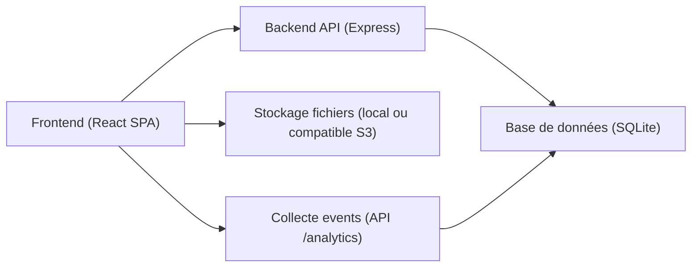
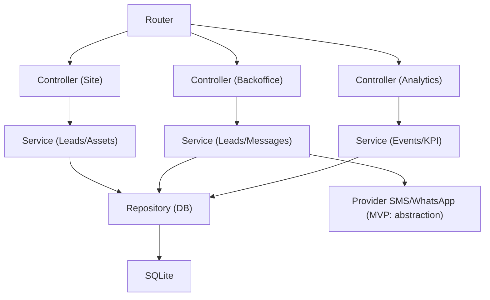
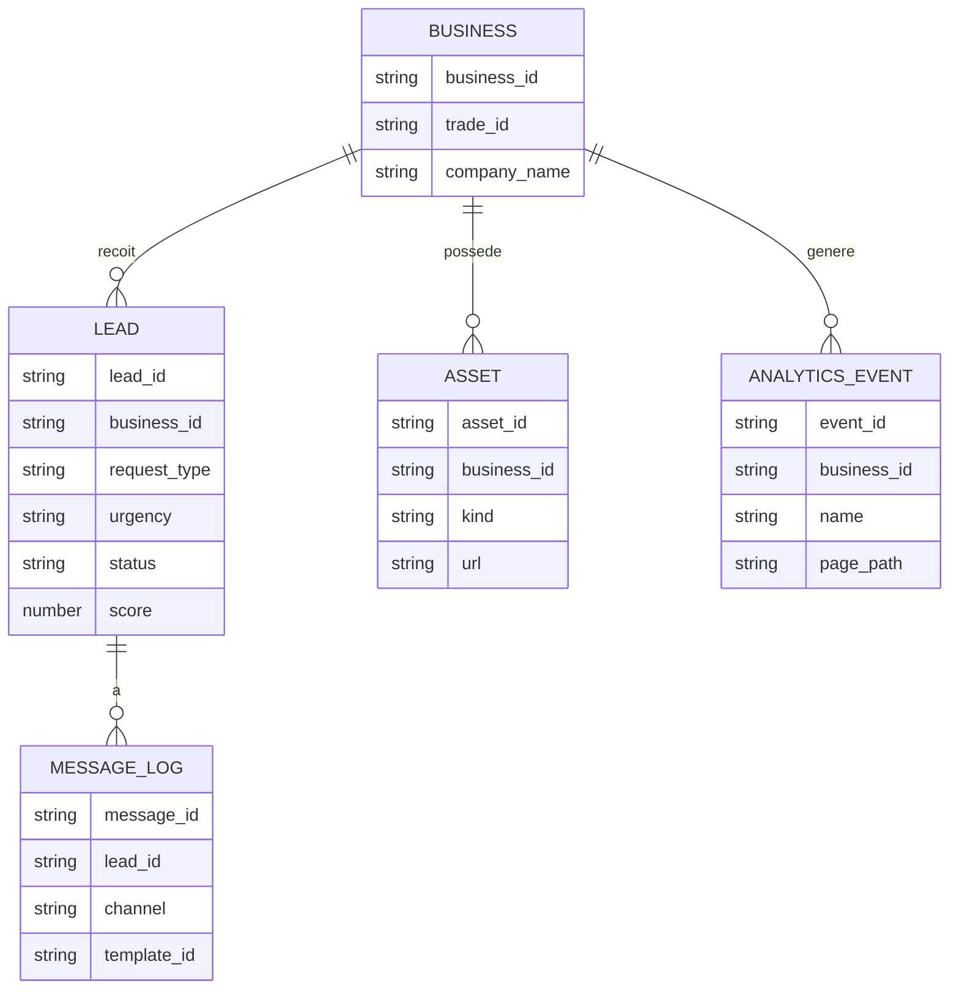

## 1. Conception d’architecture



## 2. Description des technologies

- Frontend : React 18 + TypeScript + Vite + Tailwind CSS
- Backend : Node.js + Express (API REST)
- Base de données : SQLite (MVP), avec schéma inspiré de `product/data_model.yml`
- Stockage fichiers : local (MVP) via dossier uploads + URLs servies par l’API
- Auth backoffice : session cookie ou bearer token (MVP simple)

## 3. Définition des routes (frontend)

| Route | Objectif |
|------|----------|
| /site/:businessId | Site public (Accueil, Services, Zones, Tarifs) |
| /site/:businessId/services | Page Services |
| /site/:businessId/zones | Page Zones |
| /site/:businessId/tarifs | Page Tarifs |
| /backoffice/:businessId/login | Connexion backoffice |
| /backoffice/:businessId | Inbox demandes |
| /backoffice/:businessId/leads/:leadId | Fiche lead |
| /backoffice/:businessId/stats | Dashboard |
| /backoffice/:businessId/settings | Réglages |
| /backoffice/:businessId/availability | Disponibilités |

## 4. Définitions API (backend)

Le contrat est décrit dans `product/api_contract.yml`. Les structures TypeScript doivent refléter :
- `Lead` (sans exposer PII dans analytics)
- `MessageLog`
- `AnalyticsEvent`

## 5. Diagramme d’architecture serveur



## 6. Modèle de données

### 6.1 ERD (simplifié)



### 6.2 DDL (indicatif, SQLite)

```sql
CREATE TABLE business (
  business_id TEXT PRIMARY KEY,
  trade_id TEXT NOT NULL,
  company_name TEXT NOT NULL,
  phone_e164 TEXT NOT NULL,
  city TEXT NOT NULL,
  zone_label TEXT NOT NULL,
  config_json TEXT NOT NULL,
  created_at TEXT NOT NULL,
  updated_at TEXT NOT NULL
);

CREATE TABLE lead (
  lead_id TEXT PRIMARY KEY,
  business_id TEXT NOT NULL,
  trade_id TEXT NOT NULL,
  request_type TEXT NOT NULL,
  urgency TEXT NOT NULL,
  channel_preference TEXT NOT NULL,
  first_name TEXT NOT NULL,
  phone_e164 TEXT NOT NULL,
  email TEXT,
  city TEXT NOT NULL,
  postal_code TEXT NOT NULL,
  address TEXT,
  description TEXT,
  photos_json TEXT,
  photos_count INTEGER NOT NULL DEFAULT 0,
  slot_preference TEXT,
  answers_json TEXT,
  in_zone INTEGER NOT NULL,
  phone_valid INTEGER NOT NULL,
  score REAL NOT NULL,
  decision TEXT NOT NULL,
  tags_json TEXT NOT NULL,
  status TEXT NOT NULL,
  first_human_response_at TEXT,
  appointment_json TEXT,
  outcome_json TEXT,
  attribution_json TEXT,
  created_at TEXT NOT NULL,
  updated_at TEXT NOT NULL,
  FOREIGN KEY (business_id) REFERENCES business(business_id)
);

CREATE INDEX idx_lead_business_created ON lead(business_id, created_at);
CREATE INDEX idx_lead_business_status ON lead(business_id, status);

CREATE TABLE message_log (
  message_id TEXT PRIMARY KEY,
  business_id TEXT NOT NULL,
  lead_id TEXT NOT NULL,
  channel TEXT NOT NULL,
  template_id TEXT NOT NULL,
  rendered_text TEXT NOT NULL,
  provider_message_id TEXT,
  status TEXT NOT NULL,
  created_at TEXT NOT NULL,
  FOREIGN KEY (business_id) REFERENCES business(business_id),
  FOREIGN KEY (lead_id) REFERENCES lead(lead_id)
);

CREATE TABLE analytics_event (
  event_id TEXT PRIMARY KEY,
  business_id TEXT NOT NULL,
  session_id TEXT NOT NULL,
  trade_id TEXT NOT NULL,
  name TEXT NOT NULL,
  page_type TEXT NOT NULL,
  page_path TEXT NOT NULL,
  properties_json TEXT,
  utm_json TEXT,
  referrer TEXT,
  created_at TEXT NOT NULL,
  FOREIGN KEY (business_id) REFERENCES business(business_id)
);

CREATE INDEX idx_event_business_created ON analytics_event(business_id, created_at);
CREATE INDEX idx_event_business_name ON analytics_event(business_id, name);
```

