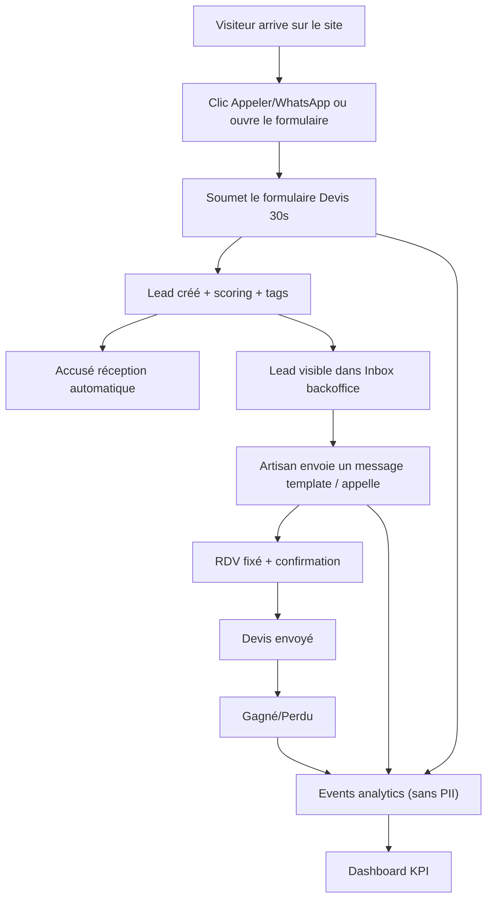

## 1. Vue d’ensemble du produit
Machine à Devis est un générateur de sites “métiers” + un backoffice qui transforme une demande locale en lead qualifié (capture → tri → réponse → suivi).
- Problème : les artisans perdent des demandes (site non optimisé, réponses tardives, mauvaises demandes, aucune mesure).
- Valeur : augmenter les demandes qualifiées et le taux de conversion, avec un système simple et mesurable.

## 2. Fonctionnalités cœur

### 2.1 Rôles utilisateurs
| Rôle | Mode d’accès | Permissions principales |
|------|-------------|-------------------------|
| Public (client final) | Accès libre | Consulter le site, soumettre une demande, cliquer appeler/WhatsApp |
| Owner (artisan) | Connexion | Voir/qualifier les demandes, envoyer messages, fixer RDV, stats, réglages |
| Staff (secrétariat) | Connexion | Même que Owner sauf réglages sensibles (option) |

### 2.2 Modules fonctionnels
1. **Site public (par entreprise)** : Accueil, Services, Zones, Tarifs, CTA sticky, formulaire “Devis en 30 secondes”.
2. **Moteur de génération** : assemblage des pages via blueprints + contenus métier + placeholders.
3. **Leads & scoring** : création lead, calcul in_zone, score/decision/tags, statuts.
4. **Backoffice** : Inbox, fiche lead, actions 1 clic (appeler, SMS/WhatsApp, RDV, gagné/perdu).
5. **Messagerie** : templates communs + par métier, envoi SMS/WhatsApp, journalisation.
6. **Analytics & dashboard** : events sans PII, attribution UTM, KPI simples.
7. **Onboarding & settings** : zone, services, disponibilités, tarifs transparents, branding minimal.

### 2.3 Détails par page
| Page | Module | Description |
|------|--------|-------------|
| Site — Accueil | Hero + CTA | Message métier+ville, CTA Appeler/WhatsApp/Devis 30s, preuves (avis, badges) |
| Site — Accueil | Services | Cartes services (3–8), renvoi vers Services |
| Site — Accueil | Disponibilité | “Prochaine dispo” (manuel en V1) + CTA rappel |
| Site — Accueil | Avis & preuves | Extraits d’avis + photos réelles |
| Site — Accueil | Formulaire | Form “Devis 30s” (questions métier + photos requises selon cas) |
| Site — Services | Liste services | Sections par service, CTA inline vers formulaire |
| Site — Zones | Couverture | Liste zones + FAQ locale + CTA |
| Site — Tarifs | Transparence | Explication calcul, blocs déplacement/diagnostic, FAQ tarifs, CTA |
| Backoffice — Inbox | Liste | Filtres (urgent, à relancer), colonnes (statut, tags, demande, ville), actions 1 clic |
| Backoffice — Fiche lead | Détails | Infos, photos, timeline, notes, actions (messages/RDV/statut) |
| Backoffice — Stats | KPI | Demandes, qualifiées, délai réponse, sources, (won/lost si suivi) |
| Backoffice — Réglages | Paramètres | Zone, services, disponibilité, tarifs, templates, SLA |

## 3. Processus cœur

### 3.1 Flux “client final → demande”
1) Visite du site (UTM persistés si présents)  
2) Clic “Appeler” / “WhatsApp” ou ouverture du formulaire  
3) Soumission du formulaire (avec photo si nécessaire)  
4) Accusé réception automatique  

### 3.2 Flux “artisan → conversion”
1) Lead arrive dans Inbox (score/decision/tags)  
2) Action 1 clic : appeler / message template / demander photo / proposer créneau  
3) Fixer RDV → confirmer par message  
4) Mettre à jour statut : devis envoyé / gagné / perdu  
5) Consulter stats (demandes, sources, délai de réponse)  

## 4. Design UI

### 4.1 Style
- Direction : utilitaire premium (confiance + rapidité), orienté conversion.
- Couleurs : fond neutre, 1 couleur primaire personnalisée (branding), accent “urgence”.
- Boutons : CTA très visibles, sticky mobile, contrastés.
- Typo : lisible (sans effets), hiérarchie claire (H1 fort + sous-titre court).
- Layout : sections courtes, preuves tôt, formulaire simple, peu de distraction.

### 4.2 Vue design par page (résumé)
| Page | Module | UI |
|------|--------|----|
| Site | CTA | Sticky mobile 3 boutons (Appeler / WhatsApp / Devis) |
| Site | Formulaire | Progression courte, champs conditionnels, upload photo simple |
| Backoffice | Inbox | Table compacte + filtres + actions 1 clic |
| Backoffice | Fiche lead | Panneau latéral / page dédiée, timeline claire |
| Backoffice | Stats | Cartes KPI + 2–3 graphiques max |

### 4.3 Responsive
- Desktop-first, mobile-adaptatif.
- Priorité mobile : CTA sticky, lisibilité, formulaire rapide, performance.

